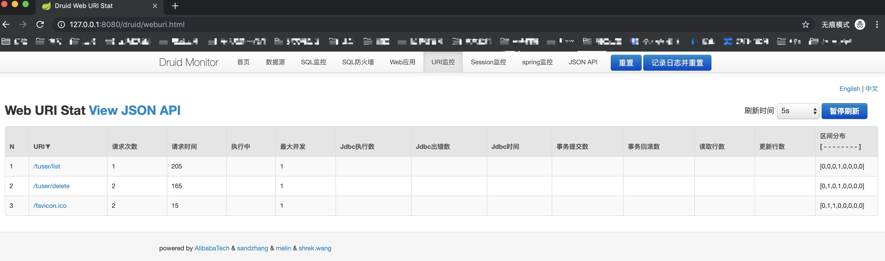

#### 参阅[SpringBoot学习目录](https://www.jianshu.com/p/9a08417e4e84) | [github项目地址](https://github.com/hengboy/api-boot)

##### [第一章：用一个HelloWord来阐述SpringBoot的简单与快速](https://www.jianshu.com/p/2a37c26d1928)

**开发工具**

    IDEA
    
    Spring Boot v2.1.4
    
    JDK1.8
    
    Maven3
    
###### 1.构建springboot项目

方式一：使用[SPRING INITIALIZR](start.spring.io/)构建

    填写相应参数即可
    
方式二：IDEA构建 -采用此方式

    Create New Project->Spring Initializr(选择SDK:1.8)->next
    
    ->填写构建等信息(Group | Aritifact | Type | package |...)
    
    ->next->勾选web依赖
    
------------------------------------------------
    
##### [第二章：SpringBoot与JSP间不可描述的秘密](https://www.jianshu.com/p/90a84c814d0c)

**SpringBoot与jsp集成渲染视图**

    Step1:pom.xml中添加依赖
    
            <!-- spring boot tomcat jsp支持开启-->
            <dependency>
                <groupId>org.apache.tomcat.embed</groupId>
                <artifactId>tomcat-embed-jasper</artifactId>
            </dependency>
            <!-- servlet支持开启-->
            <dependency>
                <groupId>javax.servlet</groupId>
                <artifactId>javax.servlet-api</artifactId>
            </dependency>
            <!--jstl支持开启(jstl标签来处于页面逻辑)-->
            <dependency>
                <groupId>javax.servlet</groupId>
                <artifactId>jstl</artifactId>
            </dependency>
            
    Step2:配置视图
    
        main包下创建目录 /webapp/WEB-INF/jsp
        
    Step3:/resources/application.properties添加配置
    
        #1。springBoot与jsp整合,配置springmvc请求前缀和后缀
        spring.mvc.view.prefix=/WEB-INF/jsp/
        spring.mvc.view.suffix=.jsp

    Step4:添加Controller -IndexController.java
    
    Step5:启动项目，浏览器访问:http://127.0.0.1/index2
  
------------------------------------------------

##### [第三章：SpringBoot使用SpringDataJPA完成CRUD](https://www.jianshu.com/p/b6932740f3c0)

**SpringBoot访问mysql**

    创建项目时可直接指定Dependencies(Web/SQL/JPA)
    
###### 1.添加pom.xml依赖

    <!-- SpringBoot访问mysql数据库，结合SpringDataJPA完成CRUD添加的依赖-->
    <!--Spring data jpa-->
    <dependency>
        <groupId>org.springframework.boot</groupId>
        <artifactId>spring-boot-starter-data-jpa</artifactId>
    </dependency>
    <!--mysql-->
    <dependency>
        <groupId>mysql</groupId>
        <artifactId>mysql-connector-java</artifactId>
        <scope>runtime</scope>
    </dependency>
    
**注：若使用内部tomcat运行项目，需要将spring-boot-starter-tomcat的scope标签注释掉**

###### 2.配置数据源以及JPA

    #添加配置文件application.yml(相比.properties配置更有层次感)
    #配置DataSource及JPA
    spring:
      datasource:      #配置mysql数据源
        url: jdbc:mysql://127.0.0.1:3306/bootdb?characterEncoding=utf8
        driverClassName: com.mysql.jdbc.Driver
        username: root
        password: shiyufeng
    jpa:
      database: MySQL
      show-sql: true   #用来在控制台输出JPA自动生成的sql语句
      hibernate:
        naming_strategy: org.hibernate.cfg.ImprovedNamingStrategy
        
###### 3.创建数据库及数据库表结构

    create database bootdb;

    create table t_user(t_id int(11)  NOT NULL auto_increment,t_name varchar(30),t_age int(10),t_address varchar(100),PRIMARY KEY(t_id))ENGINE=InnoDB DEFAULT CHARSET=utf8;

###### 4.编写springmvc实体类TUserEntity

###### 5.创建JPA(TUserJPA),使用SpringDataJPA完成数据库操作。

###### 6.编写springmvc控制器类TUserController,引入jpa并编写控制器中的各(CRUD)方法，可通过浏览器访问

###### 7.启动项目。地址栏输出，测试CRUD

    #测试访问list所有数据
    http://127.0.0.1:8080/tuser/list 返回[]
    
    #测试保存save功能
    http://127.0.0.1:8080/tuser/save?name=syf&age=31&address=beijing 返回{"id":1,"name":"syf","age":31,"address":"beijing"}
    http://127.0.0.1:8080/tuser/save?id=2&name=syf&age=31&address=beijing 返回{"id":2,"name":"syf","age":31,"address":"beijing"}
    
    #测试更新save功能
    http://127.0.0.1:8080/tuser/save?id=1&name=syf&age=18&address=haerbin 返回{"id":1,"name":"syf","age":18,"address":"haerbin"}
    **注意：每个字段均需给值，否则JPA认为是NULL值，会将未赋值的字段设置为NULL值**
    
    #再查询list
    http://127.0.0.1:8080/tuser/list 返回[{"id":1,"name":"syf","age":18,"address":"haerbin"},{"id":2,"name":"syf","age":31,"address":"beijing"}]
    
    #测试删除delete功能
    http://127.0.0.1:8080/tuser/delete?id=2 返回[{"id":1,"name":"syf","age":18,"address":"haerbin"}]
    **删除后自动返回了列表数据**
    
------------------------------------------------

##### [第四章：使用Druid作为SpringBoot项目数据源（添加监控）](https://www.jianshu.com/p/e84e2709f383)

**Druid是一个关系型数据库连接池，它是阿里巴巴的一个开源项目。Druid支持所有JDBC兼容数据库，包括了Oracle、MySQL、PostgreSQL、SQL Server、H2等**

**Druid在监控、可扩展性、稳定性和性能方面具有明显的优势。通过Druid提供的监控功能，可以实时观察数据库连接池和SQL查询的工作情况。使用Druid连接池在一定程度上可以提高数据访问效率。**

目标：SpringBoot整合Druid完成Mysql数据库访问，及配合Druid监控模块整合

###### 1.SpringBoot整合Druid完成mysql数据库访问

    (1)添加Druid依赖(https://mvnrepository.com/artifact/com.alibaba/druid),选择1.0.29版本
    <dependency>
        <groupId>com.alibaba</groupId>
        <artifactId>druid</artifactId>
        <version>1.0.29</version>
    </dependency>    
    
    (2)手动导入(右下角->Enable Auto import->会自动下载maven依赖jar到本地.m2目录并构建到项目中)
    
    (3)添加Druid配置(application.yml)
    spring:
      datasource: #配置mysql数据源
        type: com.alibaba.druid.pool.DruidDataSource
        driver-class-name: com.mysql.jdbc.Driver
        url: jdbc:mysql://127.0.0.1:3306/bootdb?characterEncoding=utf8
        username: root
        password: shiyufeng
        #配置监控统计拦截的filters，去掉后监控界面sql将无法统计，wall用于防火墙
        filters: stat,wall,log4j
        #最大活跃数
        maxActive: 20
        #初始化数量
        initialSize: 1
        #最大连接等待超时时间
        maxWait: 60000
        #打开PSCache,并且指定每个连接PSCache的大小
        poolPreparedStatements: true
        maxPoolPreparedStatementPerConnectionSize: 20
        #通过connectionProperties属性来打开mergeSql功能，慢sql记录
        connectionProperties: druid.stat.mergeSql=true;druid.stat.slowSqlMillis=5000
        minIdle: 1
        timeBetweenEvictionRunsMillis: 60000
        minEvictableIdleTimeMillis: 300000
        validationQuery: select 1 from dual
        testWhileIdle: true
        testOnBorrow: false
        testOnReturn: false
    jpa:
      properties:
        hibernate:
          show_sql: true
          format_sql: true
          
    **上面配置中的filters：stat表示已经可以使用监控过滤器，这时结合定义一个过滤器，就可以用来监控数据库的使用情况**
    
    (4)启动项目。观察：SpringBoot将Druid当做dataSource加载到了项目中
       访问url:127.0.0.1:8080/user/list 能够查询数据说明配置成功。
       
###### 2.开启Druid监控功能

**开启监控功能，可以在应用运行的过程中，通过监控提供的多维度数据来分析使用数据库的运行情况，从而可以调整程序设计，以便于优化数据库的访问性能**

    #实现Druid访问Servlet以及Filter
    DruidConfiguration.java
    
    #上述配置完成了Druid监控，重启项目
    
    #访问在url:127.0.0.1:8080/druid/login.html ->显示登录页面(输入DruidConfiguration配置的用户druid和密码123456，即可登录)
    
    #显示监控首页，包括模块:数据源、SQL监控、SQL防火墙、Web应用、URI监控、Session监控、JSONAPI等

------------------------------------------------

##### [第五章：配置使用FastJson返回Json视图](https://www.jianshu.com/p/14df78573cb2)

    fastJson是阿里巴巴旗下的一个开源项目之一，顾名思义它专门用来做快速操作Json的序列化与反序列化的组件。它是目前json解析最快的开源组件没有之一！在这之前jaskJson是命名为快速操作json的工具，而当阿里巴巴的fastJson诞生后jaskjson就消声匿迹了，不过目前很多项目还在使用
    
**目标：将fastJson加入到SpringBoot项目内，配置json返回视图使用fastJson解析**

###### 1。[添加maven依赖](https://mvnrepository.com/artifact/com.alibaba/fastjson/1.2.31)

    <!-- https://mvnrepository.com/artifact/com.alibaba/fastjson -->
    <dependency>
        <groupId>com.alibaba</groupId>
        <artifactId>fastjson</artifactId>
        <version>1.2.31</version>
    </dependency>
    
###### 2。创建FastJsonConfiguration1配置信息类

###### 3。启动项目,url请求http://127.0.0.1:8080/tuser/list

    #未加"SerializerFeature.WriteNullListAsEmpty"时，显示:(空值nul显示null)
    [{"id":1,"name":"syf","age":18,"address":"haerbin"},{"id":3,"name":"syf","age":31,"address":"beijing"},{"id":4,"name":"lisi","age":0,"address":"beijing"},{"id":5,"name":"zhangsan","age":14,"address":null}]

    #添加后显示:(空值null被替换成"") --未测试出来
    [{"id":1,"name":"syf","age":18,"address":"haerbin"},{"id":3,"name":"syf","age":31,"address":"beijing"},{"id":4,"name":"lisi","age":0,"address":"beijing"},{"id":5,"name":"zhangsan","age":14,"address":""}]
    
------------------------------------------------

##### [第六章：如何在SpringBoot项目中使用拦截器](https://www.jianshu.com/p/f69b21731b41

**拦截器应用：日志记录，用户登录状态拦截，安全拦截**

    SpringBoot内部集成的是SpringMVC控制框架，所以使用起来跟SpringMVC没有区别，只是在配置上有点不同
    
**目标：SpringBoot中是如何配置拦截器，使用拦截器来完成简单的用户登录状态判定。**

    1。前端页面login.jsp(登录用户名和密码及登录按钮)及index.jsp页面准备
    
    2。配置控制器-SpringBoot内置SpringMVC控制器转发到对应的JSP页面，我们创建名叫LoginController的类文件，并加入登录用户的方法
    
    3。修改t_user表结构，增加t_pwd密码列:alter table t_user add column t_pwd varchar(10);并更新密码值为123
    
    4。实体类TUserEntity加入t_pwd相应配置
    
    5。完善LoginController类，将TUserJPA使用SpringBean形式注入，并完善简单登录逻辑
    
    6。添加初始化登录页面转发配置IndexController,增加/login_view及/login_index
    
    7。创建拦截器 SessionInterceptor.java
    
    8。将SessionInterceptor拦截器添加到SpringBoot的配置中,让SpringBoot项目有这么一个拦截器存在. SessionConfiguration.java
    
    9。地址栏请求:http://127.0.0.1:8080/user/login_view 显示登录页面 测试即可。
    
------------------------------------------------   

##### [SpringBoot整合JavaMail发送邮件](https://www.jianshu.com/p/0991f0841b0a)