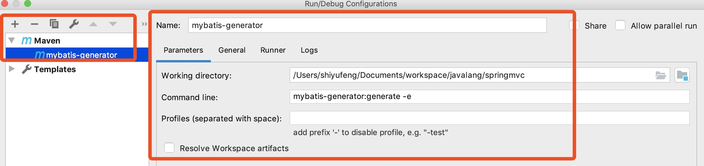

## spring + springmvc + mybatis + maven框架搭建  ---开心玉凤 2019.4.13

--------------------------------------------

### 一。概念

#### 1.Spring

    Spring 是一个开源框架，它是为了解决企业应用开发的复杂性而创建的。
     
    Spring 使用基本的 JavaBean 来完成以前只可能由 EJB 完成的事情。
    
    然而， Spring 的用途不仅限于服务器端的开发。从简单性、可测试性和松耦合的角度而言，任何 Java 应用都可以从 Spring 中受益。 
    
    简单来说， Spring 是一个轻量级的控制反转（ IoC ）和面向切面（ AOP ）的容器框架。

#### 2.SpringMVC

    Spring MVC属于 SpringFrameWork 的后续产品，已经融合在 Spring Web Flow 里面。 
    
    Spring MVC分离了控制器、模型对象、分派器以及处理程序对象的角色，这种分离让它们更容易进行定制。
      
#### 3.MyBatis

    MyBatis本是apache的一个开源项目iBatis, 2010 年这个项目由 apache software foundation 迁移到了 google code ，并且改名为 MyBatis
    
    MyBatis是一个基于Java的持久层框架。iBATIS提供的持久层框架包括 SQL Maps 和 Data Access Objects （ DAO ） 
    
    MyBatis消除了几乎所有的JDBC代码和参数的手工设置以及结果集的检索。 
    
    MyBatis使用简单的XM或注解用于配置和原始映射，将接口和Java的POJOs （ Plain Old Java Objects ，普通的Java 对象）映射成数据库中的记录。

--------------------------------------------

### 二。构建maven项目-SSM(Spring+SpringMVC+Mybatis)

参考:[SSM三大框架整合详细总结（Spring+SpringMVC+MyBatis）](https://cloud.tencent.com/developer/article/1041053?fromSource=waitui)

#### IDEA创建Maven项目

    框架版本：

    Spring 4.0.2 RELEASE
    
    Spring MVC 4.0.2 RELEASE
    
    MyBatis 3.2.6

##### 1.添加依赖pom.xml

##### 2.整合spring 与 mybatis

###### 2-1 建立jdbc.propreties,配置数据源

###### 2-2 创建测试用的数据库和表

    create database springmvcdb
    
    CREATE TABLE `t_user` (
      `id` int(11) NOT NULL AUTO_INCREMENT,
      `user_name` varchar(40) NOT NULL,
      `password` varchar(255) NOT NULL,
      `age` int(4) NOT NULL,
      PRIMARY KEY (`id`)
    ) ENGINE=InnoDB AUTO_INCREMENT=2 DEFAULT CHARSET=utf8;
    
    insert into `t_user`(`id`,`user_name`,`password`,`age`) values (1,'syf','123',30);

###### 2-3 利用MyBatis Generator自动创建代码

参考：[IDEA 2018集成MyBatis Generator 插件 详解](https://blog.csdn.net/yangqinfeng1121/article/details/80183516)

    (1).pom.xml添加"集成MyBatis Generator 插件"
    (2).编写generatorConfig.xml
    (3).右上角->Edit Configurations..->+号->maven->
        命令：mybatis-generator:generate -e
    (4)执行即可生成Tuser.java / TUserMapper.java / TUserMapper.xml
        


###### 2-4 建立service接口(ITUserService)和实现类(ITUserServiceImpl)

###### 2-5 建立测试类，测试spring+mybatis整合是否通过

    (1).src/main目录下创建test测试目录
    (2).在service实现类文件ITUserServiceImpl.java中，选中ITUserServiceImpl
    (3).command+shift+T 自动创建测试类，选择junit4
    (4).测试文件会创建在test目录下面:ITUserServiceImplTest.java
    (5).编写测试内容，执行，成功
    
##### 3.整合springmvc --在web.xml中配置整合

###### 3-1 创建spring-mvc.xml配置文件

###### 3-2 重构web.xml配置文件，配置整合

###### 3-3 创建Controller类(TUserController)

###### 3-4 部署tomcat项目，项目名称/

###### 3-5 浏览器访问http://localhost:8080/user/toTuser?id=1,浏览器打印显示结果syf

--------------------------------------------
--------------------------------------------

## 在上述ssm项目基础上添加多数据源----

## spring + spring + mybatis + maven (使用Spring AOP实现MySQL数据库读写分离)

### 1.利用docker搭建主从分离数据库

参见：Technology/互联网/数据库/关系数据库/mysql/[mysql主从同步与读写分离-Docker.md](syf/mysql主从同步与读写分离-Docker.md) 

$ docker run -p 3306 --name mysql-master -v /Users/shiyufeng/learn/mysql/master/data:/var/lib/mysql -e MYSQL_ROOT_PASSWORD=master -d master/mysql

$ docker run -p 3306 --name mysql-slave -v /Users/shiyufeng/learn/mysql/slave/data:/var/lib/mysql -e MYSQL_ROOT_PASSWORD=slave -d slave/mysql

shiyufeng:~ shiyufeng$ docker ps
CONTAINER ID        IMAGE               COMMAND                  CREATED             STATUS              PORTS                                NAMES
4020b16cc851        slave/mysql         "docker-entrypoint.s…"   2 hours ago         Up 2 hours          33060/tcp, 0.0.0.0:32775->3306/tcp   mysql-slave
cc02389a2c8c        master/mysql        "docker-entrypoint.s…"   2 hours ago         Up 2 hours          33060/tcp, 0.0.0.0:32774->3306/tcp   mysql-master

#### (1)登录主库创建数据库和表并写入一条数据

$ docker exec -it mysql-master bash
$ root@cc02389a2c8c:/# mysql -uroot -pmaster 
mysql>create database springmvc
mysql>use springmvc
mysql> CREATE TABLE `t_user` (
    ->       `id` int(11) NOT NULL AUTO_INCREMENT,
    ->       `user_name` varchar(40) NOT NULL,
    ->       `password` varchar(255) NOT NULL,
    ->       `age` int(4) NOT NULL,
    ->       PRIMARY KEY (`id`)
    ->     ) ENGINE=InnoDB AUTO_INCREMENT=2 DEFAULT CHARSET=utf8;
    
mysql> insert into `t_user`(`id`,`user_name`,`password`,`age`) values (1,'syf','123',30);
mysql> select * from t_user;
+----+-----------+----------+-----+
| id | user_name | password | age |
+----+-----------+----------+-----+
|  1 | syf       | 123      |  30 |
+----+-----------+----------+-----+
1 row in set (0.00 sec)

#### (2)登录从数据库查看主库数据已同步

$ docker exec -it mysql-slave bash
$ root@cc02389a2c8c:/# mysql -uroot -pslave
mysql> show databases; #显示springmvc数据库
mysql> use springmvc;
mysql> show tables;
+---------------------+
| Tables_in_springmvc |
+---------------------+
| t_user              |
+---------------------+
mysql> select * from t_user;
+----+-----------+----------+-----+
| id | user_name | password | age |
+----+-----------+----------+-----+
|  1 | syf       | 123      |  30 ||
+----+-----------+----------+-----+
2 rows in set (0.00 sec)

//更新t_user表数据。目的：测试主从获取数据明显
mysql> update t_user set password='666' where id=1;
mysql> insert into `t_user`(`id`,`user_name`,`password`,`age`) values (2,'slave','8',88);
mysql> select * from t_user;
+----+-----------+----------+-----+
| id | user_name | password | age |
+----+-----------+----------+-----+
|  1 | syf       | 666      |  30 |
|  2 | slave     | 8        |  88 |
+----+-----------+----------+-----+

**上述mysql主从数据库已经配置完毕!!!**

**项目代码**

(1).修改jdbc.properties配置数据源

(2).修改spring-mybatis配置文件，添加主从数据源配置

(3).创建文件夹datasource，用于编写数据源相关代码

A.DataSourceAspect.java  定义aop切面，目的实现主从数据库切换
B.DynamicDataSource.java 定义动态切换主从数据源
C.DataSourceChange.java  自定义注解
D.DataSourceAspectException.java 自定义异常类
E.ITUserServiceImpl  实现类方法上增加自定义注解
F.ITUserServiceImplTest  自定义测试类，分别用于测试主从数据库

项目代码参见:

[spring-spring mvc-mybatis实现主从数据库配置](https://www.cnblogs.com/aegisada/p/5699058.html)

[spring+springmvc+mybatis+maven+mysql数据库读写分离](https://blog.csdn.net/zhao3587717/article/details/83309647)

--------------------------------------------
--------------------------------------------

## 在ssm项目多数据源基础上整合redis

# Docker下redis的主从配置

参考[Docker下redis的主从配置](https://blog.csdn.net/qq_36183935/article/details/80794167)

## 1.拉取redis镜像

    docker pull daocloud.io/library/redis:latest
    
## 2.启动3个redis容器服务，分别使用到6379、6380、6381端口

    # --name指定容器名称  -p指定宿主机与虚拟机端口映射  -d指定镜像
    $ docker run --name redis-6379 -p 6379:6379 -d daocloud.io/library/redis
    
    $ docker run --name redis-6380 -p 6380:6379 -d daocloud.io/library/redis
    
    $ docker run --name redis-6381 -p 6381:6379 -d daocloud.io/library/redis
   
## 3.查看容器

    shiyufeng:redis shiyufeng$ docker ps | grep redis
    5f0d05fcc01c        daocloud.io/library/redis   "docker-entrypoint.s…"   8 seconds ago       Up 8 seconds        0.0.0.0:6381->6379/tcp               redis-6381
    13ad84d8671c        daocloud.io/library/redis   "docker-entrypoint.s…"   15 seconds ago      Up 14 seconds       0.0.0.0:6380->6379/tcp               redis-6380
    2090161b82d2        daocloud.io/library/redis   "docker-entrypoint.s…"   23 seconds ago      Up 23 seconds       0.0.0.0:6379->6379/tcp               redis-6379

## 4.测试容器,成功

     shiyufeng:redis shiyufeng$ docker exec -it redis-6379 bash
     root@2090161b82d2:/data# redis-cli
     127.0.0.1:6379> set key-a value-a
     OK
     127.0.0.1:6379> get key-a
     "value-a"
     127.0.0.1:6379> quit
     root@2090161b82d2:/data# exit
     exit
     
## 5.redis集群配置

### 5.1 查看容器内网ip地址

    $ docker inspect redis-6379   //NetworkSettings->IPAddress->172.17.0.4
    $ docker inspect redis-6380   //172.17.0.5
    $ docker inspect redis-6381   //172.17.0.6
    
### 5.2 进入容器内部。查看当前redis角色(主/从)

    #当前三个容器redis角色均为master
    root@2090161b82d2:/data# redis-cli
    127.0.0.1:6379> info replication
    # Replication
    role:master
    connected_slaves:0
    master_replid:6226836fa0d3de254aa0e776ab3b22f11462a89e
    master_replid2:0000000000000000000000000000000000000000
    master_repl_offset:0
    second_repl_offset:-1
    repl_backlog_active:0
    repl_backlog_size:1048576
    repl_backlog_first_byte_offset:0
    repl_backlog_histlen:0
    
### 5.3 使用redis-cli命令修改redis-6380、redis-6381的主机为172.17.0.4:6379

    shiyufeng:data shiyufeng$ docker exec -it redis-6380 bash
    root@13ad84d8671c:/data# redis-cli 
    127.0.0.1:6379> SLAVEOF 172.17.0.4 6379
    OK
    
    shiyufeng:~ shiyufeng$ docker exec -it redis-6381 bash
    root@5f0d05fcc01c:/data# redis-cli
    127.0.0.1:6379> SLAVEOF 172.17.0.4 6379
    OK
    
### 5.4 查看redis-6379是否已经拥有2个从机，connected_slaves:2

    127.0.0.1:6379> info replication
    # Replication
    role:master
    connected_slaves:2
    slave0:ip=172.17.0.5,port=6379,state=online,offset=84,lag=0
    slave1:ip=172.17.0.6,port=6379,state=online,offset=84,lag=0
    master_replid:39b96e101a7c100cf4073ad916653a30730e9f42
    master_replid2:0000000000000000000000000000000000000000
    master_repl_offset:84
    second_repl_offset:-1
    repl_backlog_active:1
    repl_backlog_size:1048576
    repl_backlog_first_byte_offset:1
    repl_backlog_histlen:84
 
### 5.5 配置Sentinel哨兵
 
    进入3台redis容器内部进行配置，在容器根目录里面创建sentinel.conf文件
    
    文件内容为：sentinel monitor mymaster 172.17.0.4 6379 1 
   
    #分别配置redis-6379 / redis-6380 / redis-6381 
    $ docker exec -it redis-6379 bash
    
    root@2090161b82d2:/data# cd / && touch sentinel.conf 
    
    #若提示无vim,解决方案：$ apt-get update && apt-get install vim
    root@2090161b82d2:/# vim sentinel.conf 
    
    #添加内容：sentinel monitor mymaster 172.17.0.4 6379 1 
    
    #启动redis哨兵
    root@2090161b82d2:/# redis-sentinel ./sentinel.conf 
    343:X 01 May 2019 06:58:44.878 # oO0OoO0OoO0Oo Redis is starting oO0OoO0OoO0Oo
    343:X 01 May 2019 06:58:44.878 # Redis version=5.0.4, bits=64, commit=00000000, modified=0, pid=343, just started
    343:X 01 May 2019 06:58:44.878 # Configuration loaded
                    _._                                                  
               _.-``__ ''-._                                             
          _.-``    `.  `_.  ''-._           Redis 5.0.4 (00000000/0) 64 bit
      .-`` .-```.  ```\/    _.,_ ''-._                                   
     (    '      ,       .-`  | `,    )     Running in sentinel mode
     |`-._`-...-` __...-.``-._|'` _.-'|     Port: 26379
     |    `-._   `._    /     _.-'    |     PID: 343
      `-._    `-._  `-./  _.-'    _.-'                                   
     |`-._`-._    `-.__.-'    _.-'_.-'|                                  
     |    `-._`-._        _.-'_.-'    |           http://redis.io        
      `-._    `-._`-.__.-'_.-'    _.-'                                   
     |`-._`-._    `-.__.-'    _.-'_.-'|                                  
     |    `-._`-._        _.-'_.-'    |                                  
      `-._    `-._`-.__.-'_.-'    _.-'                                   
          `-._    `-.__.-'    _.-'                                       
              `-._        _.-'                                           
                  `-.__.-'                                               
    
    343:X 01 May 2019 06:58:44.880 # WARNING: The TCP backlog setting of 511 cannot be enforced because /proc/sys/net/core/somaxconn is set to the lower value of 128.
    343:X 01 May 2019 06:58:44.887 # Sentinel ID is c6d5f58f947160b43ee1996e66fd0ed5f0d87274
    343:X 01 May 2019 06:58:44.887 # +monitor master mymaster 172.17.0.4 6379 quorum 1
    343:X 01 May 2019 06:58:44.888 * +slave slave 172.17.0.5:6379 172.17.0.5 6379 @ mymaster 172.17.0.4 6379
    343:X 01 May 2019 06:58:44.889 * +slave slave 172.17.0.6:6379 172.17.0.6 6379 @ mymaster 172.17.0.4 6379
    343:X 01 May 2019 07:03:18.428 * +sentinel sentinel df353b7623d86d3c7d445a56841d506740151a12 172.17.0.6 26379 @ mymaster 172.17.0.4 6379
    343:X 01 May 2019 07:03:34.573 * +sentinel sentinel 062e6cbb381fb222d0e4f0ed5b70b28bbac47a10 172.17.0.5 26379 @ mymaster 172.17.0.4 6379

**Sentinel哨兵配置完毕**

### 5.6 测试-关闭master

    $ docker stop redis-6379
    
    #redis-6381容器,发现原redis-6379变成了从机，redis-6381变成了主机(随机)
    root@5f0d05fcc01c:/# redis-sentinel ./sentinel.conf 
    329:X 01 May 2019 07:03:16.380 # oO0OoO0OoO0Oo Redis is starting oO0OoO0OoO0Oo
    329:X 01 May 2019 07:03:16.380 # Redis version=5.0.4, bits=64, commit=00000000, modified=0, pid=329, just started
    329:X 01 May 2019 07:03:16.380 # Configuration loaded
                    _._                                                  
               _.-``__ ''-._                                             
          _.-``    `.  `_.  ''-._           Redis 5.0.4 (00000000/0) 64 bit
      .-`` .-```.  ```\/    _.,_ ''-._                                   
     (    '      ,       .-`  | `,    )     Running in sentinel mode
     |`-._`-...-` __...-.``-._|'` _.-'|     Port: 26379
     |    `-._   `._    /     _.-'    |     PID: 329
      `-._    `-._  `-./  _.-'    _.-'                                   
     |`-._`-._    `-.__.-'    _.-'_.-'|                                  
     |    `-._`-._        _.-'_.-'    |           http://redis.io        
      `-._    `-._`-.__.-'_.-'    _.-'                                   
     |`-._`-._    `-.__.-'    _.-'_.-'|                                  
     |    `-._`-._        _.-'_.-'    |                                  
      `-._    `-._`-.__.-'_.-'    _.-'                                   
          `-._    `-.__.-'    _.-'                                       
              `-._        _.-'                                           
                  `-.__.-'                                               
    
    329:X 01 May 2019 07:03:16.382 # WARNING: The TCP backlog setting of 511 cannot be enforced because /proc/sys/net/core/somaxconn is set to the lower value of 128.
    329:X 01 May 2019 07:03:16.389 # Sentinel ID is df353b7623d86d3c7d445a56841d506740151a12
    329:X 01 May 2019 07:03:16.389 # +monitor master mymaster 172.17.0.4 6379 quorum 1
    329:X 01 May 2019 07:03:16.390 * +slave slave 172.17.0.5:6379 172.17.0.5 6379 @ mymaster 172.17.0.4 6379
    329:X 01 May 2019 07:03:16.391 * +slave slave 172.17.0.6:6379 172.17.0.6 6379 @ mymaster 172.17.0.4 6379
    329:X 01 May 2019 07:03:18.283 * +sentinel sentinel c6d5f58f947160b43ee1996e66fd0ed5f0d87274 172.17.0.4 26379 @ mymaster 172.17.0.4 6379
    329:X 01 May 2019 07:03:34.573 * +sentinel sentinel 062e6cbb381fb222d0e4f0ed5b70b28bbac47a10 172.17.0.5 26379 @ mymaster 172.17.0.4 6379
    329:X 01 May 2019 07:10:03.597 # +new-epoch 1
    329:X 01 May 2019 07:10:03.597 # +vote-for-leader 062e6cbb381fb222d0e4f0ed5b70b28bbac47a10 1
    329:X 01 May 2019 07:10:03.607 # +sdown master mymaster 172.17.0.4 6379
    329:X 01 May 2019 07:10:03.607 # +odown master mymaster 172.17.0.4 6379 #quorum 1/1
    329:X 01 May 2019 07:10:03.607 # Next failover delay: I will not start a failover before Wed May  1 07:16:04 2019  #发现异常
    329:X 01 May 2019 07:10:03.607 # +sdown sentinel c6d5f58f947160b43ee1996e66fd0ed5f0d87274 172.17.0.4 26379 @ mymaster 172.17.0.4 6379
    329:X 01 May 2019 07:10:04.836 # +config-update-from sentinel 062e6cbb381fb222d0e4f0ed5b70b28bbac47a10 172.17.0.5 26379 @ mymaster 172.17.0.4 6379
    329:X 01 May 2019 07:10:04.836 # +switch-master mymaster 172.17.0.4 6379 172.17.0.6 6379 #切换主机由4更为6
    329:X 01 May 2019 07:10:04.837 * +slave slave 172.17.0.5:6379 172.17.0.5 6379 @ mymaster 172.17.0.6 6379
    329:X 01 May 2019 07:10:04.837 * +slave slave 172.17.0.4:6379 172.17.0.4 6379 @ mymaster 172.17.0.6 6379
    329:X 01 May 2019 07:10:34.849 # +sdown slave 172.17.0.4:6379 172.17.0.4 6379 @ mymaster 172.17.0.6 6379

### 6.pom.xml引入redis相关配置

### 7.配置redis属性(redis-ms.properties)

### 8.配置redis(spring-redis-ms.xml)

### 9.创建redis-utils类(redis/RedisUtils 和 redis/RedisPool单机版)

### 10.创建测试类(RedisCacheTest)

参考:

[redis入门——Spring整合篇]-测试成功单机版 (https://blog.csdn.net/q547550831/article/details/55048591#%E9%9B%86%E7%BE%A4%E7%89%88)

[Spring技术栈-整合Redis，通过Redis的Master-Slave实现缓存数据读写分离](https://blog.csdn.net/zyhlwzy/article/details/78519853)

[Spring技术栈-整合Redis，使用RedisTemplate实现数据缓存实战](https://blog.csdn.net/zyhlwzy/article/details/78470851)

[SSM(七)在JavaWeb应用中使用Redis](https://crossoverjie.top/2016/12/18/SSM7/)